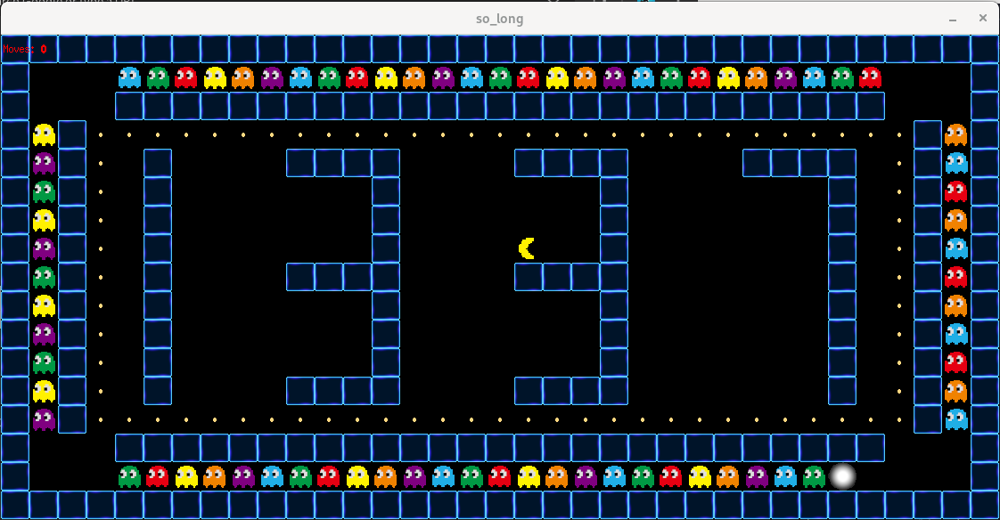

# so_long

> A simple 2D game built using the MiniLibX graphics library, where the player must collect all collectibles and reach the exit while navigating a tile-based map. Developed as part of the 42 curriculum to practice event handling, graphics, and game loop logic.


🎮 As part of this project, I had the opportunity to implement a Pac-Man-inspired game, which helped expand my understanding of real-time game mechanics, sprite movement and animation within a 2D map system.
---

## 📚 Project Overview

**so_long** is a small graphical game using a 2D grid map. The player controls a character to collect all items (`C`) and exit the map (`E`) without breaking the rules. The project focuses on rendering a tile-based environment using MiniLibX, handling user inputs, and managing game state updates.

---

## 🧠 Key Concepts

- Event-driven programming
- MiniLibX graphics library
- Game loops and rendering
- Map parsing and validation
- Input handling and animation
- File I/O (reading `.ber` maps)
- Sprite animation and frame updates in bonus part
- Enemy logic and autonomous movement in bonus part

---

## 🎮 Game Rules

- The map must contain **1 player** (`P`), **1 exit** (`E`), **at least 1 collectible** (`C`), and **optionally at least 1 ghost** (`G`) in bonus maps.
- The player moves using **W/A/S/D** keys
- The goal is to collect all collectibles and reach the exit
- The game ends when the player reaches the exit **after collecting all items**

---

## 🗺️ Map Format (`.ber`)

Each map file should follow these rules:

- Rectangular shape
- Surrounded by walls (`1`)
- Contains only valid characters: `0` (empty space), `1` (wall), `P` (player), `E` (exit), `C` (collectible), and if you run bonus part `G` (Enemy)

Example:
> have a look at **maps** folder at the top

## 🛠️ Usage

1. **Clone the repository And Navigate to it:**

```bash
 git clone https://github.com/Mohamed-ait-alla/so_long.git
 cd so_long
```

2. **Compilation & Usage:**

- ***To run mandatory part:***

```bash
	make
	./so_long maps/<choose a map>
```

- ***To run bonus part:***

```bash
	make bonus
	./so_long_bonus maps/<choose a map>
```

## 📁 Project Structure

so_long/<br>
├── bonus/<br>
│   ├── ft_\*\_bonus.c<br>
│   └── so_long_bonus.c<br>
│<br>
├── ft_printf/<br>
│	├── ft_printf_utils.c<br>
│	├── ft_printf.c<br>
│   └── ft_printf.h<br>
│<br>
├── get_next_line/<br>
│   ├── get_next_line.c<br>
│   ├── get_next_line_utils.c<br>
│   └── get_next_line.h<br>
│<br>
├── Includes/<br>
│	├── so_long_bonus.h<br>
│   └── so_long.h<br>
│<br>
├── libft/<br>
│   ├── ft_\*.c<br>
│   ├── libft.c<br>
│   └── Makefile<br>
│<br>
├── maps/<br>
│   └── *.ber<br>
│<br>
├── srcs/<br>
│   ├── ft_\*.c<br>
│   └── so_long.c<br>
│<br>
├── textures/<br>
│   └── *.xpm<br>
│<br>
├── Makefile<br>
└── README.md<br>

## 📎 License

This project is part of the 42 School curriculum.
